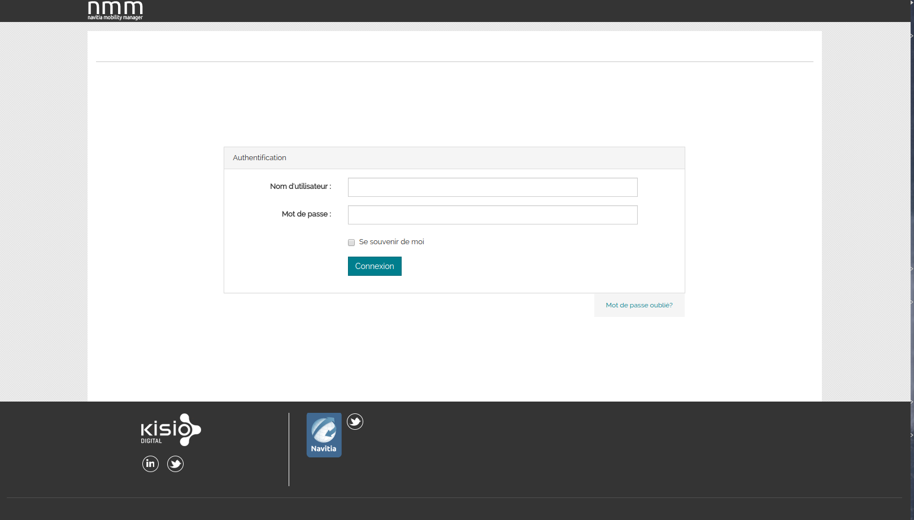

<h2>What is NMM</h2>

Navitia Mobility Manager(NMM) is a portal that centralize the backoffice products  of Kisio Digital.

<h2>Application</h2>
 

- [Timetable](https://github.com/CanalTP/MttBundle)

<h2>Installation</h2>

Please refer to [installation documentation](docs/installation_nmm.md) 

